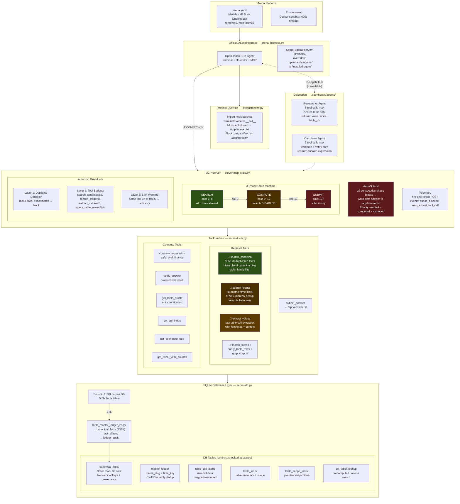

# OfficeQA Arena — v5 Gating Infrastructure

Technical specification grounded in the actual codebase as of 2026-04-01.

---

## 1. Architecture Diagram



---

## 2. System Components

### 2.1 Arena Harness (`arena_harness.py`)

The `OfficeQALocalHarness` extends `OpenHandsSDKAgent` to replicate the competition platform's file layout locally. On `setup()`, it:

1. Calls `super().setup()` — installs OpenHands SDK, generates `run_agent.py`
2. Uploads `server/`, `prompts/`, `overrides/` to `/installed-agent/`
3. Uploads `run_mcp.sh`, `install.sh`, `requirements.txt`
4. Uploads `.openhands/agents/` sub-agent definitions
5. `chmod +x /installed-agent/run_mcp.sh`

This ensures `arena test` (local Docker) is identical to `arena submit` (competition sandbox).

**Config** (`arena.yaml`):
| Key | Value |
|-----|-------|
| Model | `openrouter/minimax/minimax-m2.5` |
| Temperature | `0.0` |
| Max iterations | `15` |
| Task timeout | `600s` |
| MCP transport | `stdio` via `/installed-agent/run_mcp.sh` |
| Terminal override | `PYTHONPATH=/installed-agent/overrides` |

### 2.2 MCP Server (`server/mcp_stdio.py`)

A zero-dependency JSON-RPC 2.0 server over stdin/stdout implementing the MCP protocol. It manages:

- **Phase gating** (deterministic FSM)
- **Anti-spin guardrails** (3 layers)
- **Auto-submit protocol** (safety net)
- **Telemetry** (fire-and-forget POST)

On startup, it auto-discovers the SQLite DB and validates the **DB contract** — checks for existence of `canonical_facts`, `master_ledger`, `table_cell_blobs`, `table_index`, and `table_scope_index`.

---

## 3. Gating Logic — The 3-Phase State Machine

### Phase Determination

The phase is determined **purely by call count** — a deterministic finite state machine, not a probabilistic or history-dependent mechanism:

```python
# mcp_stdio.py:428-434
call_num = len(_call_history) + 1
if call_num <= 8:    current_phase = "search"
elif call_num <= 12: current_phase = "compute"
else:                current_phase = "submit"
```

### Phase 1 — SEARCH (calls 1–8)

All tools are available. The agent should follow this priority:

| Priority | Tool | Data Source | When to Use |
|----------|------|-------------|-------------|
| Gold | `search_canonical` | `canonical_facts` (935K deduped) | Always start here |
| Fallback | `search_ledger` | `master_ledger` (flat index) | If canonical returns empty |
| Silver | `extract_values` | `table_cell_blobs` + `table_index` | If both above fail |
| Bronze | `search_tables` → `query_table_rows` | `table_index` + raw cells | Emergency fallback |
| Last resort | `grep_corpus` | Raw `.txt` bulletin files | Should almost never be needed |

### Phase 2 — COMPUTE (calls 9–12)

Only `_COMPUTE_TOOLS` are allowed:
```
compute_expression, verify_answer, get_table_profile,
get_cpi_index, get_exchange_rate, get_fiscal_year_bounds,
submit_answer, query_table_rows
```

Any search tool call returns a JSON-RPC result (not an error) containing a `warning` field:
```
PHASE CHANGE: Search phase ended at call 8. You have data — use it now.
ALLOWED TOOLS: compute_expression, verify_answer, get_table_profile, submit_answer
BLOCKED: search_canonical is no longer available.
Remaining budget: 3 calls. Compute your answer and submit.
```

### Phase 3 — SUBMIT (calls 13+)

Only `submit_answer`, `verify_answer`, `compute_expression` are allowed. All other tools return:
```
FINAL PHASE: Submit your answer NOW.
```

### Why Call-Count Gating (Not History-Based)

The model (MiniMax M2.5) ignores prompt-based instructions to stop searching ([feedback memory: MiniMax ignores prompts](../memory/feedback_minimax_ignores_prompts.md)). Prompt warnings ("you've searched enough") don't work — the model continues calling search tools indefinitely. The **hard phase boundary at call 8** is a structural cutoff that cannot be circumvented by the model.

---

## 4. Anti-Spin Guardrails

Three independent layers, checked in sequence on every tool call:

### Layer 1 — Exact Duplicate Detection (`mcp_stdio.py:516-537`)

Checks the last 3 entries in `_call_history`. If the same `(tool_name, normalized_args_json)` appears, the call is blocked immediately with:
```
DUPLICATE CALL: You already called search_canonical with identical arguments.
```

Note: duplicate-blocked calls do **not** advance the iteration counter (they return before being appended to `_call_history`).

### Layer 2 — Per-Tool Budget Caps (`mcp_stdio.py:539-580`)

| Tool | Max Calls | Scope |
|------|-----------|-------|
| `search_canonical` | 6 | Global |
| `search_ledger` | 5 | Global |
| `extract_values` | 5 | Global |
| `query_table_rows` | 4 | Per `table_pk` |
| `get_file_structure` | ∞ (cached) | Result cached by `file_id` |

Exceeding a budget returns a warning with an alternative tool suggestion.

### Layer 3 — Spin Pattern Detection (`mcp_stdio.py:599-607`)

If the same tool appears **3+ times in the last 5 calls**, a `_spin_warning` advisory is injected into the tool result's `_meta` field. This is **non-blocking** — the tool still executes.

### Counter Behavior

- **`_call_history`**: Appends ALL calls, including phase-blocked ones (`BLOCKED:tool_name`). This means blocked calls still advance the call counter, preventing infinite loops.
- **`_consecutive_blocks`**: Reset to 0 on any successful tool dispatch. Only counts consecutive phase blocks.
- **`_tool_call_counts`**: Only incremented for successfully dispatched calls.

---

## 5. Auto-Submit Protocol

**Trigger**: `_consecutive_blocks >= 2` (two or more consecutive phase-blocked calls).

**Fallback priority chain** (`mcp_stdio.py:467`):
```python
fallback = tools._best_verified_answer    # from verify_answer tool
         or tools._last_computed           # from compute_expression tool
         or tools._last_extracted_value    # from first retrieval result
```

**Action**:
1. Write `str(fallback).strip()` directly to `/app/answer.txt`
2. Send `auto_submit` telemetry event
3. Return a warning to the model: `AUTO-SUBMITTED: ... your best answer has been written`

**If no fallback exists** (no value was ever extracted), the model receives:
```
You have NO computed answer yet. Call compute_expression NOW, then submit_answer.
```

This protocol exists because MiniMax M2.5 frequently keeps calling search tools in the compute phase, burning through all iterations without ever submitting.

---

## 6. Database Architecture

### Source → Serving Pipeline

```
11GB corpus DB (5.8M facts)
         │
         ▼
  build_master_ledger_v2.py  ──→  officeqa_slim_v2.sqlite3 (~serving DB)
         │                              │
         │  classifies columns          ├── canonical_facts (935K rows)
         │  deduplicates by bulletin    ├── fact_aliases
         │  resolves conflicts          ├── ledger_audit
         │  builds hierarchical keys    │
         │                              │  (also contains from ingestion:)
         ▼                              ├── master_ledger
                                        ├── table_index
                                        ├── table_scope_index
                                        ├── table_cell_blobs
                                        ├── table_first_table_cells
                                        ├── table_first_tables
                                        ├── table_dedup_groups
                                        └── col_label_lookup (precomputed)
```

### `canonical_facts` Schema (Gold Path)

```sql
CREATE TABLE canonical_facts (
    fact_pk           INTEGER PRIMARY KEY AUTOINCREMENT,
    canonical_key     TEXT NOT NULL,     -- hierarchical: family > title > row_label [> col_label]
    entity_key        TEXT NOT NULL,     -- full entity phrase
    metric_key        TEXT NOT NULL,     -- metric identifier
    metric_type       TEXT NOT NULL,     -- "time" | "dimension"
    time_key          TEXT NOT NULL,     -- "1940", "1940-06", "CY1940", "FY1940"
    year              INTEGER,
    month             INTEGER,
    value             REAL NOT NULL,     -- raw numeric value (NOT scaled)
    unit_type         TEXT,              -- "dollars", "percent", "pieces", "other"
    unit_multiplier   REAL DEFAULT 1.0,  -- 1000 = "in thousands of dollars"
    unit_raw          TEXT,              -- original unit string
    table_title       TEXT,
    table_family      TEXT,              -- one of 7 families (see below)
    section_path      TEXT,
    row_label         TEXT,
    column_label      TEXT,
    period_basis      TEXT,              -- "calendar", "fiscal", "monthly"
    frequency         TEXT,
    source_file       TEXT,              -- e.g. "treasury_bulletin_1940_06.txt"
    source_table_pk   INTEGER,
    bulletin_date     TEXT,              -- "1940-06"
    confidence        REAL,
    is_canonical      INTEGER DEFAULT 1, -- 1 = latest bulletin for this dedup group
    variant_count     INTEGER DEFAULT 1  -- how many source tables have this fact
);
```

**Table families** (7 categories):
`public_debt`, `revenue_receipts`, `federal_securities`, `international_capital`, `monetary`, `cash_operations`, `budget_expenditures`

### `canonical_key` Construction

The key is **entity context only** — time columns are excluded:

```python
# If metric_type == "time":  canonical_key = family > title > row_label
# If metric_type == "dimension": canonical_key = family > title > row_label > column_label
```

Example: `"public_debt > public debt of the united states > interest-bearing debt > treasury bonds"`

### `master_ledger` Schema (Fallback Path)

```sql
-- Flat metric×time index, deduplicated (latest bulletin wins)
-- Columns: metric_slug, time_key, period_basis, value, value_raw,
--          table_pk, source_file, table_title, row_type
```

Time keys: `CY1940` (calendar year), `FY1940` (fiscal year), `1940-12` (monthly).
Dedup strategy: for each `(metric_slug, time_key)`, prefer synthetic CY/FY rows, then latest bulletin by source_file date.

### `table_cell_blobs` (Raw Cells)

Msgpack-encoded cell data for full table reconstruction. Used by `extract_values` and `query_table_rows` as a last resort when the canonical and ledger paths don't have what's needed.

### DB Auto-Discovery (`run_mcp.sh`)

Priority order:
1. `$OFFICEQA_SQLITE_DB` env var (set by `arena.yaml`)
2. `/app/corpus/officeqa_enriched.sqlite3` (competition sandbox)
3. `/app/corpus/officeqa_corpus.sqlite3`
4. `./data/officeqa_slim_v2.sqlite3` (local dev)
5. Auto-download from `http://147.182.206.223:9090/officeqa_slim_v2.sqlite3.zst`

---

## 7. Terminal Override (`overrides/sitecustomize.py`)

A Python import hook that patches `TerminalExecutor.__call__` before the agent loop starts. Loaded via `PYTHONPATH=/installed-agent/overrides` in `arena.yaml`.

**Allowed commands**:
- `echo/printf/tee/cat-heredoc → /app/answer.txt` (write final answer)
- `cat /app/answer.txt` (sanity-check)
- `pip/apt-get` (package management)
- `mkdir/chmod/ls/pwd/cd/test` (filesystem helpers)

**Everything else is blocked** with a helpful message nudging the agent to MCP tools. This prevents the model from bypassing the phase-gated MCP surface by running `grep` / `cat` / `sed` directly on `/app/corpus/` files.

---

## 8. Delegation Infrastructure

Two sub-agent roles defined in `.openhands/agents/`:

### Researcher Agent
- **Budget**: 5 tool calls max
- **Allowed**: `search_canonical`, `search_ledger`, `extract_values`, `get_table_profile`, `search_tables`, `query_table_rows`, `get_file_structure`, `get_time_series`
- **Forbidden**: `compute_expression`, `verify_answer`, `submit_answer`, terminal
- **Returns**: Structured `FOUND / UNITS / TABLE_PK / SOURCE / CONFIDENCE / NOTES`

### Calculator Agent
- **Budget**: 3 tool calls max
- **Allowed**: `compute_expression`, `verify_answer`
- **Forbidden**: All search tools, terminal, file writes
- **Returns**: `ANSWER / EXPRESSION / UNITS / VERIFIED`

Delegation is optional — only available if `DelegateTool` appears in the model's tool list.

---

## 9. Telemetry

Fire-and-forget POST to `TELEMETRY_URL` (webhook.site). Runs in a daemon thread, never blocks the agent.

Events:
| Event | Fields |
|-------|--------|
| `phase_blocked` | tool, phase, call_number, consecutive_blocks |
| `auto_submit` | answer (first 200 chars), reason |
| `tool_call` | tool, args, latency_s, result_len, is_error, result_preview |

All events include `task_id`, `run_id`, and `ts`.

---

## 10. Evaluation & Testing

### Testing Path

All testing runs through the competition infrastructure — **never locally** ([feedback: no local runs](../memory/feedback_no_local_runs.md)):

```
arena test   →  local Docker sandbox (replicates competition)
arena submit →  competition platform (Daytona sandbox)
```

### Local Eval Harness (`scripts/eval.py`)

For development iteration, `scripts/eval.py` runs the same agent loop with the same MCP tool surface:

```bash
python3 scripts/eval.py \
    --cases data/officeqa_full.csv \
    --db data/officeqa_corpus.sqlite3 \
    --subset UID0004,UID0023 \
    --parallel 2 \
    --save-traces traces/
```

Each case:
1. Loads the question from CSV/JSON/JSONL
2. Resets tool budgets (`tools.reset_budgets()`)
3. Runs `run_agent_loop()` with the MCP tool surface
4. Scores with `fuzzy_match_answer()` / `score_answer()`
5. Classifies failures into buckets

### Failure Classification Buckets

| Bucket | Detection Logic |
|--------|----------------|
| `correct` | score ≥ 1.0 |
| `timeout` | empty prediction (no answer submitted) |
| `units_scale` | predicted/expected ratio ≈ 1000× or 1,000,000× |
| `over_filter` | ≥3 empty `query_table_rows` results AND >30% of total tool calls |
| `math_compute` | numeric answer within 20% of expected |
| `wrong_row_col` | numeric answer within 20-50% of expected |
| `retrieval_wrong_table` | both predicted and expected are numeric but far apart |
| `unknown` | none of the above |

### v5 Test Results (`results/daytona_v5_phase_gating.jsonl`)

Sample results from the gating infrastructure test run:

| UID | Question Type | Gold | Predicted | Issue |
|-----|--------------|------|-----------|-------|
| UID0023 | Multi-step lookup | 2.24 | *(empty)* | Timeout — 11 iterations, never submitted |
| UID0004 | Calendar month aggregation | 1608.80% | 79.0 | Wrong aggregation — only computed partial |
| UID0030 | Visual (line plot maxima) | 18 | 0 | Cannot answer — requires image understanding |
| UID0033 | Date lookup | March 3, 1977 | March 1977 | Partial — missing specific day |
| UID0041 | Statistical (Theil index) | 0.011 | 4518.0 | Retrieved raw values, didn't compute index |
| UID0048 | Two-value comparison | 3% | *(empty)* | Timeout — never found both values |

### Trajectory Analysis

Per-case trajectories saved to `results/trajectories/UID*.json` containing the full agent loop log — every tool call, its arguments, results, and timing. Used for post-hoc diagnosis of why specific cases fail.

---

## 11. System Prompt (`prompts/system.j2`)

The Jinja2 template injects `{{ instruction }}` (the question) and establishes:

1. **Role**: "Senior Treasury Auditor"
2. **First step mandate**: State what data is needed and which retrieval path before any tool call
3. **3-phase workflow** with explicit call budgets
4. **Retrieval priority**: Gold → Fallback → Silver → Bronze
5. **Common mistake warnings**: wrong row, double counting, wrong year, FY vs CY, unit scale, premature answer, wrong date
6. **Answer format**: Raw number, preserve %, wrap in `<FINAL_ANSWER>` tags

---

## 12. Key Design Decisions & Rationale

| Decision | Rationale |
|----------|-----------|
| Hard phase boundaries (not prompt-based) | MiniMax M2.5 ignores prompt instructions to stop searching |
| Blocked calls still advance call counter | Prevents infinite loops where the model keeps retrying blocked tools |
| Auto-submit on 2 consecutive blocks | Safety net — a wrong answer scores higher than no answer (empty = 0 points) |
| Terminal override via import hook | Model tried to bypass MCP tools by running grep/cat on raw corpus files |
| 3-tier retrieval (canonical → ledger → extract) | canonical_facts is cleaner and faster; fallback paths exist for coverage |
| Latest bulletin dedup | Same table appears in multiple bulletins; latest version is most accurate |
| canonical_key excludes time columns | Time is a lookup dimension, not part of the entity identity |
| Column classification (time/dimension/junk) | OCR artifacts and bare year headers need filtering, but real time columns are valid data |

---

## 13. Scoring Model

From `arena.yaml`:
```
Score = correct_tasks × (1.0 + cost_adj + time_adj)
Max possible: 282.9
```

Current best: **147.86 points (65.9% accuracy)**. Target: 73%+. Deadline: 2026-04-04.
